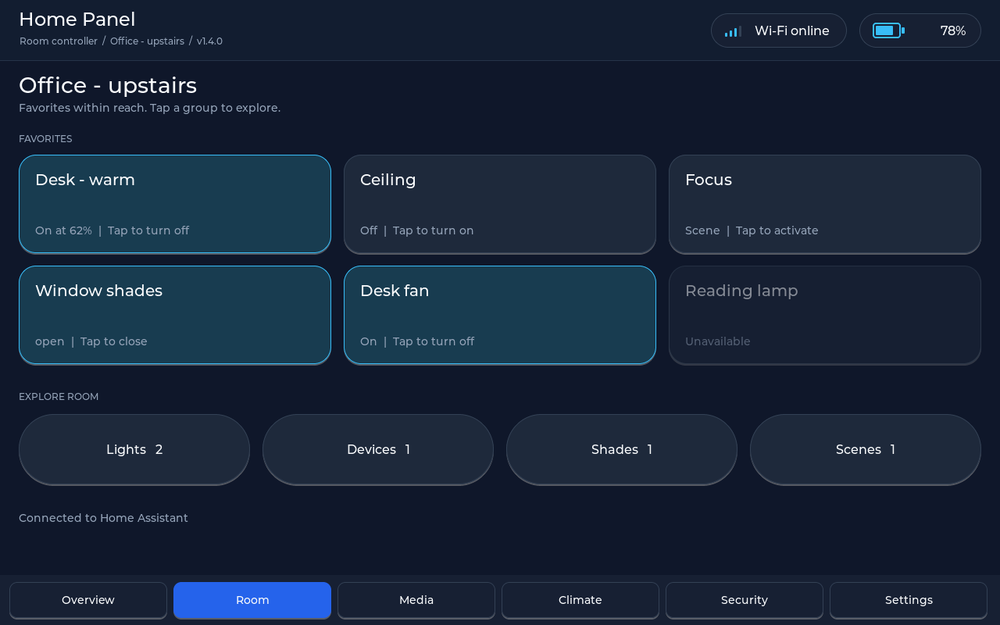
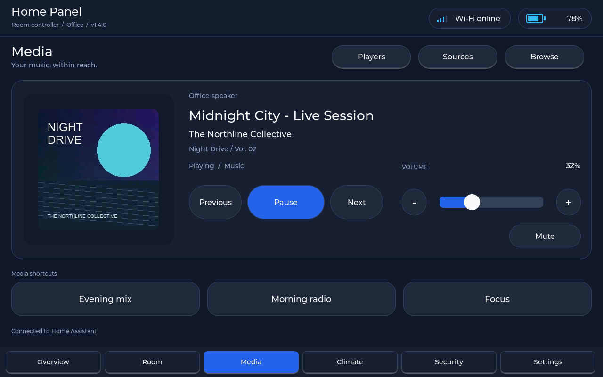

# Release 1.4.0 — a personal room panel

## Behavior

- Six optional favorites, in your chosen order. Nothing is promoted arbitrarily.
- Four rounded group buttons open a modal popup: Lights, Devices (switches and
  fans), Shades (covers), and Scenes. Each page contains six large touch targets;
  Previous/Next exposes every cached supported entity, including scenes beyond
  the old three-scene limit. The existing shared discovery cap remains 48 entities
  (including media players).
- Individual dimmable-light sliders inside the Lights popup replace the Room
  screen's aggregate brightness control. Zero turns that light off. Hidden lights
  are not targeted by these sliders. Other modules' whole-area actions and Home
  Assistant scenes retain their existing scope.
- Favorites remain in their slots when a device is missing or unavailable.
  Unavailable controls are disabled. Hidden controls stay out of favorites and
  groups. A tap on the scrim, Close, or navigation dismisses the popup.
- Home Assistant remains authoritative: controls use the existing single worker
  and bounded action queue. No optimistic device-state changes are made.
- En and em dashes display as a font-safe hyphen. UTF-8 is truncated only at
  complete codepoint boundaries; long names use an ellipsis within the tile.

## Header refinement

The persistent header now uses aligned Wi-Fi and battery capsules, a quieter
profile/area/version subtitle, a subtle divider, and bounded titles. Signal bars
replace the raw RSSI number. The battery body, terminal, fill and percentage
share a consistent vertical center; an unavailable reading clears the previous
fill, and zero percent displays an empty battery. Amber/red low-battery cues
remain. Header height, content area and navigation positions are unchanged.



## Media refinement

The Media screen now centers on a single now-playing card with native-size
artwork, a clear track/artist/album hierarchy, large transport buttons, and an
aligned volume row. Players, Sources, and Browse open rounded modal sheets with
large touch targets and a highlighted current selection. The three configured
shortcuts remain directly accessible; unused slots are hidden. Empty lists show
guidance and unavailable players disable their controls. Long metadata and tile
labels use a bounded single-line ellipsis. Volume drags retain their original
player and cancel on lost touch, player changes, or navigation.

Existing playback commands, shortcut configuration, discovery limits, and the
artwork decode/no-upscale behavior are retained.



## Room customization

Open the panel's existing authenticated web manager and find **Room controls**.
Refresh the discovered list, select Grouped/Favorite/Hidden for each entity,
optionally set a display name, and use Up/Down to arrange controls. Save once to
apply immediately and persist across restarts. Favorites also remain accessible
in their domain group. Reset restores a discovered control's HA name and grouped
placement; Reset removes a stale, undiscovered preference.

Existing configuration files require no migration: an absent `room_controls`
field loads as an empty preference list. Unconfigured entities are grouped and
sorted by HA name, then entity ID. Explicit preferences precede unconfigured
entities and follow the array order. Up to 48 preferences and six favorites are
accepted. Labels are limited to 63 UTF-8 bytes, IDs to 95 bytes. Invalid input is
rejected before changing room preferences.

```json
"room_controls": [
  {"entity_id": "light.desk", "label": "Desk — warm", "placement": 1},
  {"entity_id": "cover.window", "label": "Window", "placement": 0},
  {"entity_id": "switch.maintenance", "label": "", "placement": 2}
]
```

Placement is 0=grouped, 1=favorite, 2=hidden. Settings are local to each panel.
Hidden is a display preference, not an access restriction. The authenticated
`GET /api/room/entities` endpoint returns cached discovered controls and scenes;
`GET/POST /api/config` reads/writes `room_controls` without exposing the HA token.
Switching the configured area still follows the existing discovery/reboot flow.

## Implementation

The room snapshot is held in the module instead of on the 16 KB loop stack.
Temporary configuration copies and the web entity snapshot use checked heap
allocations. UI objects are created once and rebound; six popup tiles are reused
across pages. Popup light drags preserve their entity target until release and
cancel cleanly on lost touch or navigation. The worker rechecks the light's
availability and brightness support before issuing a request.

## Validation

See `docs/VALIDATION_1.4.0.md` for executed checks and remaining hardware checks.
No firmware upload or live Home Assistant service call is part of this update.

