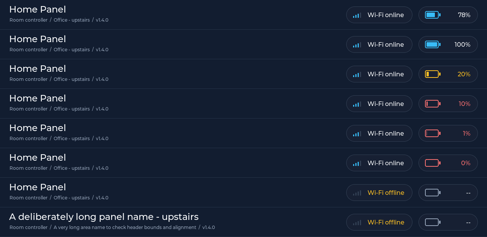
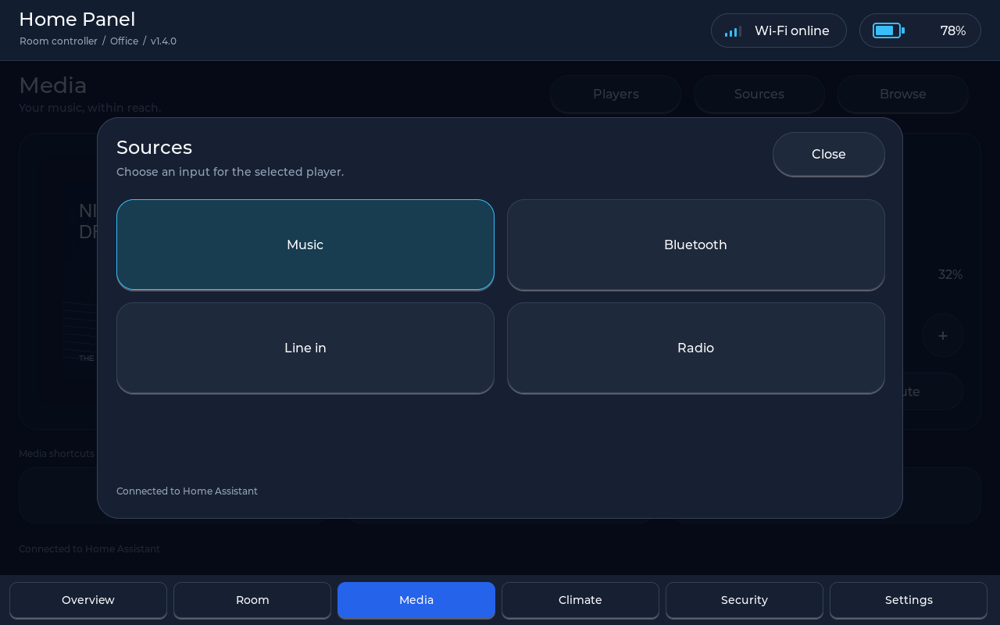
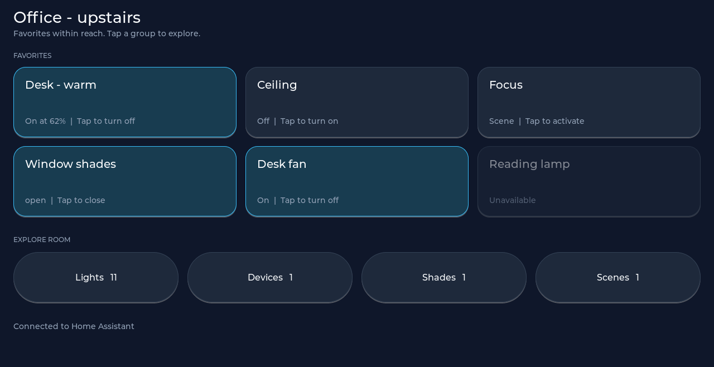
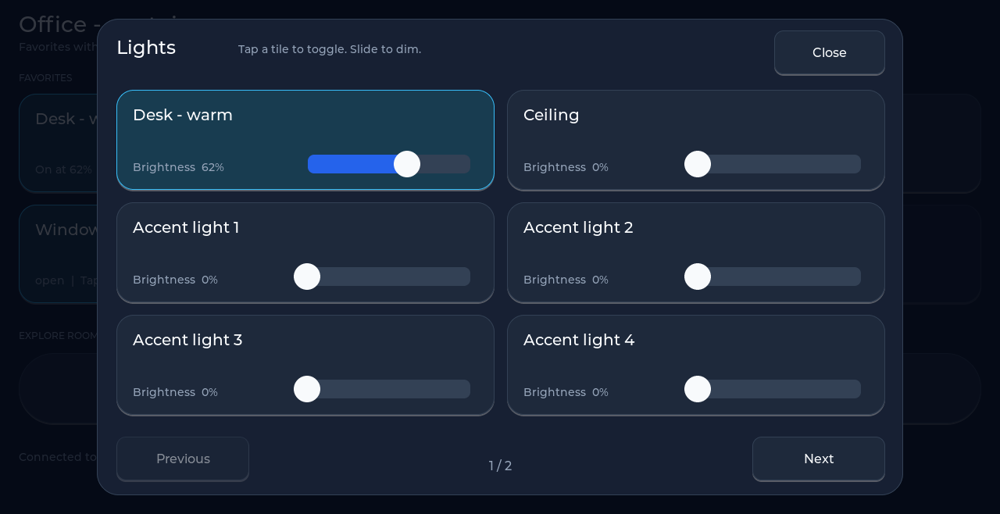
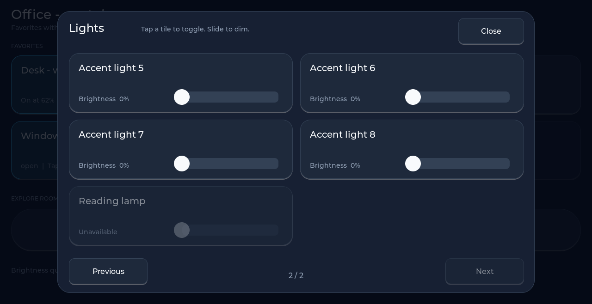
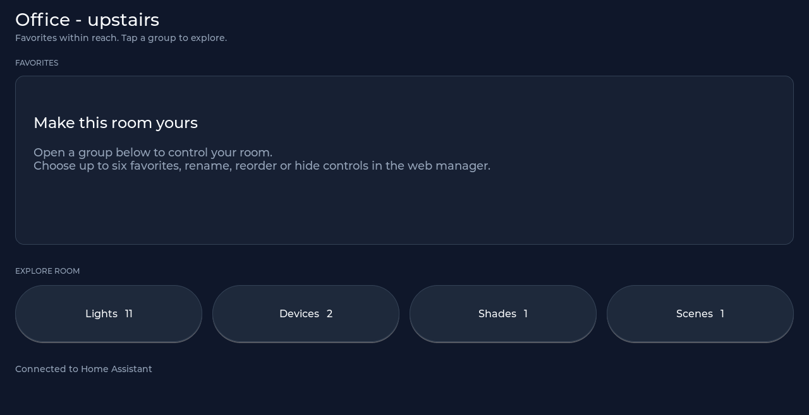

# 1.4.0 validation

## Passed

- `scripts/validate_project.py`: version, project structure, retained media and
  single-worker architecture checks.
- `tests/room_web_test.cjs`: discovery merge, missing favorite preservation,
  HTML escaping, UTF-8 names, reorder, hide, reset, and serialized save payload.
- `scripts/test_room_native.py`: compiles the real room preference parser with
  ArduinoJson 7.4.3. Covers empty/valid input, supported domains, duplicate and
  invalid IDs, type checks, six-favorite and 48-preference bounds, byte-length
  limits, and no mutation on rejection. Shared display text tests cover en/em
  dashes, accented UTF-8, truncated sequences, null text, and small buffers.
- `scripts/test_room_render.py`: compiles the real Room module against LVGL 9.3.0
  with a deterministic, offline Home Assistant fixture. Checks popup paging,
  correct action targets, hidden controls, disabling empty groups, preserving
  slider values during refresh, no accidental toggle from sliders, canceled
  drags, and popup dismissal on navigation.
- Visual inspection of four actual LVGL content-area renders at 1280x658:
  favorites, first/second Lights popup pages, and unconfigured favorites. No
  overlapping text or controls observed. Off-state slider track contrast was
  improved after inspection. These are sample-data renders, not device photos.

## Header validation

`python scripts/test_room_render.py --header` renders the actual UI shell at
1280x800 with the Room page. The battery body and terminal share an exact center;
percentage alignment differs by at most a single raster pixel. Fill remains
inside the frame at 100%, 20%, 10%, 1%, and 0%. Empty and unavailable readings hide
the fill. Offline Wi-Fi and long labels were also rendered and visually checked.

## Media validation

`python scripts/test_room_render.py --media` builds the actual Media module and
UI shell with LVGL 9.3.0 and offline fixtures. Playback, player selection, source
selection, shortcuts, and browse favorites target the intended entities. Volume
drag values survive refresh; lost-touch releases send no command. Navigation
closes the popup. Seven full-screen previews cover now-playing, all three
popups, unavailable/long metadata, empty discovery, and empty browse results.
Visual QA found and corrected title wrapping into the artist row; metadata and
tile labels now have explicit single-line heights.

The preview uses a synthetic progressive JPEG decoded through the existing
JPEGDEC header parser and stb path. Baseline JPEG decoding failed in the Windows
host harness and is not claimed as validated here. Embedded codec integer
operations require UBSan disabled in this native Media test. Production artwork
decoding is unchanged; on-device artwork and touch checks remain outstanding.

## Room previews

## Firmware compilation

Both pinned PlatformIO firmware environments rebuilt successfully after the Media refinement:

| Board | Static RAM | Application flash | Result |
|---|---:|---:|---|
| 2624 / ESP32-P4 | 91,040 / 327,680 bytes (27.8%) | 3,287,548 / 6,291,456 bytes (52.3%) | PASS |
| 2635 / ESP32-P4 R3 | 126,812 / 327,680 bytes (38.7%) | 3,288,996 / 6,291,456 bytes (52.3%) | PASS |

Firmware outputs are `.pio/build/jc8012p4a1c_2624/firmware.bin` and
`.pio/build/jc8012p4a1c_2635/firmware.bin`. These target different silicon revisions;
use the build matching the panel's rear label. Upstream ESP-IDF headers emitted
non-fatal literal-suffix warnings. No application compile errors remain.

## Hardware validation remaining

No firmware upload, physical touch test, or live Home Assistant command was
performed. After a firmware-only update, check the panel's actual area discovery,
web-save/restart persistence, live light/cover/scene actions, and disconnect/
reconnect behavior. Keep the existing SPIFFS configuration when upgrading.

The clean Windows build required a temporary short drive alias to avoid the
host's disabled long-path support. The existing framework include flags now use
quotes so paths containing backslashes or spaces reach the compiler intact.
The host's global long-path policy was not changed.

Firmware 2624 SHA-256: `0fe472ece3b5e867b770fe5df4093eeaedaa37a3471590ca46321fb7424c886f`

Firmware 2635 SHA-256: `412bed80b697c7a3198e34939e8441211474fef541cfc4f26928696a3c6e7019`

